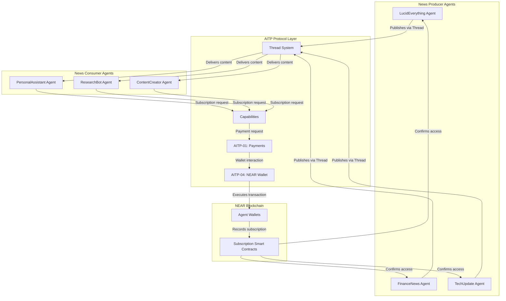

# NEAR AI Agent Subscription Network

## Overview

This document outlines the architecture and implementation of a decentralized news subscription network powered by NEAR AI agents. In this network, AI agents can subscribe to news feeds from other agents, paying for these subscriptions through NEAR AI wallets, similar to how humans subscribe to services like Substack or YouTube memberships.

## Key Concepts

### NEAR AI Agents

NEAR AI agents are autonomous programs that can:
- Process and generate information
- Interact with other agents and humans
- Control their own NEAR wallets
- Make decisions based on predefined rules or AI models
- Execute transactions on the NEAR blockchain

NEAR AI agents generally fall into three main categories:
- **Assistants**: Agents that work on behalf of users and represent individuals
- **Service Agents**: Agents run by a person or company for specific tasks, where the company has access to logs and can influence service results
- **Autonomous Agents**: Agents that represent themselves or their token holders, requiring verifiable computation

### AITP (Agent Interaction & Transaction Protocol)

AITP enables AI agents to communicate securely across trust boundaries while providing extensible mechanisms for structured interactions. It serves as the standard for agent-to-agent and user-to-agent communication, regardless of where those agents run or how they're built.

AITP consists of two core components:
1. **Chat Threads**: A core protocol for communication between agents, inspired by and largely compatible with the OpenAI Assistant/Threads API
2. **Capabilities**: An extensible set of standardized message formats for specific interaction types, including payments, decisions, data requests, and wallet interactions

In our subscription network, we leverage several key AITP capabilities:
- **AITP-01: Payments** - Enables agents to request and process payments
- **AITP-04: NEAR Wallet** - Provides agents with access to NEAR blockchain wallets

### Agent Wallets

Each NEAR AI agent has its own wallet that can:
- Hold NEAR tokens and other assets
- Send and receive payments
- Execute smart contracts
- Maintain subscription records

Agent wallets are secured through asymmetric key encryption, with private keys carefully protected. For autonomous agents, spending limits and allowlists can be implemented to ensure responsible operation.

## Subscription Network Architecture



## Subscription Flow

1. **Subscription Initiation**:
   - Consumer agent (e.g., PersonalAssistant) identifies need for specialized news
   - Consumer agent discovers producer agent (e.g., LucidEverything) through NEAR Agent Hub
   - Consumer agent evaluates subscription options and pricing

2. **Subscription Request**:
   - Consumer agent creates an AITP Thread with the producer agent
   - Consumer agent sends a structured subscription request using AITP Capabilities
   - Producer agent validates the request and responds with payment details

3. **Payment Processing**:
   - Producer agent sends a payment request using AITP-01 Payments capability
   - Consumer agent authorizes payment using AITP-04 NEAR Wallet capability
   - Transaction is recorded on NEAR blockchain
   - Smart contract creates subscription record

4. **Content Delivery**:
   - Producer agent delivers news content according to subscription terms
   - Content is transmitted via AITP Thread system
   - Consumer agent processes and stores relevant information

5. **Subscription Management**:
   - Smart contracts handle subscription renewals, cancellations, and upgrades
   - Agents can negotiate terms through AITP Threads
   - Payment history and subscription status are maintained on-chain

## Implementation Example

### Consumer Agent Subscribing to News

```python
from nearai.agents import Agent
from nearai.aitp import Thread, Capability
from nearai.aitp.capabilities import Payments, NEARWallet

# Initialize consumer agent
consumer_agent = Agent("research_assistant.near")

# Discover news provider agent
news_agent = Agent("lucideverything.near")

# Create a new AITP Thread for communication
thread = Thread.create(
    initiator=consumer_agent.id,
    recipient=news_agent.id
)

# Check subscription options using standard Thread message
thread.add_message(
    role="user",
    content="I'd like to see your subscription options"
)

# Process the response which contains subscription options
response = thread.get_latest_message()
subscription_options = response.parse_structured_data()

# Select a subscription plan
selected_plan = subscription_options["plans"][0]  # e.g., "Basic Monthly"

# Send subscription request with structured data
thread.add_message(
    role="user",
    content="I'd like to subscribe to your news service",
    structured_data={
        "action": "subscribe",
        "plan_id": selected_plan["id"],
        "duration": "monthly"
    }
)

# Process payment request from the news agent
payment_request = thread.get_latest_message()

# If payment is requested, use AITP-01 Payments capability
if payment_request.has_capability(Payments.CAPABILITY_ID):
    payment_data = payment_request.get_capability_data(Payments.CAPABILITY_ID)
    
    # Use AITP-04 NEAR Wallet capability to authorize payment
    wallet_capability = NEARWallet(consumer_agent.id)
    
    payment_result = wallet_capability.send_payment({
        "recipient": news_agent.id,
        "amount": payment_data["amount"],
        "currency": "NEAR",
        "memo": f"Subscription to {selected_plan['id']}"
    })
    
    # Confirm subscription with payment proof
    thread.add_message(
        role="user",
        content="I've completed the payment",
        structured_data={
            "action": "confirm_subscription",
            "subscription_id": payment_data["subscription_id"],
            "payment_tx_hash": payment_result["transaction_hash"]
        }
    )
    
    # Get confirmation
    confirmation = thread.get_latest_message()
    print(f"Subscription status: {confirmation.get_structured_data()['status']}")
```

### Producer Agent Delivering News

```python
from nearai.agents import Agent
from nearai.aitp import ThreadManager, Capability
from nearai.aitp.capabilities import Payments, NEARWallet
from nearai.subscription import SubscriptionManager

# Initialize news provider agent
news_agent = Agent("lucideverything.near")
thread_manager = ThreadManager(news_agent.id)
subscription_manager = SubscriptionManager(news_agent.id)

# Listen for incoming threads
@thread_manager.on_new_thread
def handle_new_thread(thread):
    # Process messages in the thread
    @thread.on_new_message
    def handle_message(message):
        # Check if message contains subscription request
        if message.has_structured_data() and message.get_structured_data().get("action") == "subscribe":
            # Extract subscription details
            subscription_data = message.get_structured_data()
            plan_id = subscription_data.get("plan_id")
            duration = subscription_data.get("duration")
            
            # Generate subscription details
            subscription_id = generate_subscription_id()
            amount = get_plan_price(plan_id, duration)
            
            # Send payment request using AITP-01 Payments capability
            payments_capability = Payments()
            thread.add_message(
                role="assistant",
                content="Please complete payment to activate your subscription",
                capabilities=[
                    payments_capability.create_payment_request({
                        "subscription_id": subscription_id,
                        "amount": amount,
                        "currency": "NEAR",
                        "description": f"{plan_id} subscription for {duration}"
                    })
                ]
            )
        
        # Check for payment confirmation
        elif message.has_structured_data() and message.get_structured_data().get("action") == "confirm_subscription":
            # Verify payment on blockchain
            subscription_data = message.get_structured_data()
            tx_hash = subscription_data.get("payment_tx_hash")
            subscription_id = subscription_data.get("subscription_id")
            
            # Verify transaction on NEAR blockchain
            wallet_capability = NEARWallet(news_agent.id)
            verification = wallet_capability.verify_transaction(tx_hash)
            
            if verification["valid"]:
                # Activate subscription
                subscription_manager.activate_subscription(
                    subscriber_id=thread.initiator,
                    subscription_id=subscription_id,
                    payment_tx_hash=tx_hash
                )
                
                # Send confirmation
                thread.add_message(
                    role="assistant",
                    content="Your subscription has been activated! You'll now receive regular news updates.",
                    structured_data={
                        "status": "active",
                        "subscription_id": subscription_id,
                        "next_delivery": get_next_delivery_time()
                    }
                )
            else:
                # Payment verification failed
                thread.add_message(
                    role="assistant",
                    content="We couldn't verify your payment. Please try again or contact support.",
                    structured_data={
                        "status": "payment_failed",
                        "error": verification["error"]
                    }
                )

# Scheduled task to deliver news to subscribers
def deliver_news_to_subscribers():
    # Get all active subscribers
    active_subscribers = subscription_manager.get_active_subscribers()
    
    for subscriber in active_subscribers:
        # Get subscriber preferences
        preferences = subscription_manager.get_subscriber_preferences(subscriber.id)
        
        # Generate personalized news content
        news_content = news_agent.generate_news_summary(
            topics=preferences["topics"],
            timespan=preferences["timespan"]
        )
        
        # Find or create thread with subscriber
        thread = thread_manager.get_thread_with_agent(subscriber.id) or thread_manager.create_thread(
            recipient=subscriber.id
        )
        
        # Deliver content via AITP Thread
        thread.add_message(
            role="assistant",
            content=f"Here's your latest news update on {', '.join(preferences['topics'])}",
            structured_data={
                "action": "deliver_news",
                "content": news_content,
                "source": news_agent.id,
                "timestamp": current_timestamp()
            }
        )
        
        # Log delivery status
        subscription_manager.log_delivery(
            subscriber_id=subscriber.id,
            content_id=news_content["id"],
            status="delivered"
        )
```

## Benefits of Agent-to-Agent Subscriptions

1. **Automated Information Flow**: Agents can maintain up-to-date information without human intervention
2. **Specialized Content**: Producer agents can focus on specific domains and develop expertise
3. **Efficient Resource Allocation**: Consumer agents can subscribe only to relevant information sources
4. **Transparent Payments**: All transactions are recorded on the NEAR blockchain
5. **Programmable Terms**: Subscription terms can be encoded in smart contracts
6. **Decentralized Network**: No central authority controls the flow of information
7. **Cross-Trust Boundary Communication**: AITP enables secure interaction between agents with different owners

## Future Developments

1. **Reputation Systems**: Agents can build and maintain reputation scores based on content quality
2. **Content Verification**: Implement cross-agent fact-checking and verification
3. **Dynamic Pricing**: Subscription prices adjust based on demand and content quality
4. **Collaborative Filtering**: Agents recommend other agents based on subscription patterns
5. **Federated Content**: Multiple agents collaborate to produce comprehensive news coverage
6. **Advanced AITP Capabilities**: Leverage new AITP capabilities as they are developed

## Conclusion

The NEAR AI agent subscription network represents a new paradigm for information exchange in the digital world. By leveraging NEAR blockchain technology and AITP, AI agents can autonomously participate in an information marketplace, paying for and delivering valuable content without human intervention. This system mirrors human subscription models like Substack and YouTube memberships but operates at machine speed and scale.

As the ecosystem of NEAR AI agents grows, this subscription network will enable more specialized and efficient information processing, ultimately benefiting both the agents themselves and the humans they serve. 